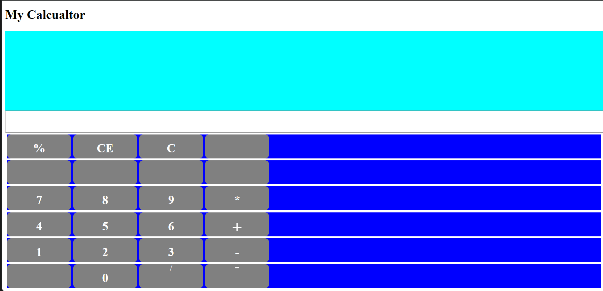

# Simple Calculator

This is a basic calculator web application created using **HTML, CSS, and JavaScript**.
It allows users to perform simple mathematical calculations directly in the browser.

## Preview

🌐 Live Website

You can try the calculator here:
🔗 https://ashiquealin99-hue.github.io/calculator-project/

## Features

* Addition
* Subtraction
* Multiplication
* Division
* Percentage
* Clear and Backspace functions
* Simple and user-friendly interface

## Technologies Used

* HTML
* CSS
* JavaScript

## How to Use

1. Enter numbers using the calculator buttons.
2. Choose an operation (+, -, *, /).
3. Press "=" to get the result.

## Project Purpose

This project was built to practice basic web development concepts and JavaScript DOM manipulation.
